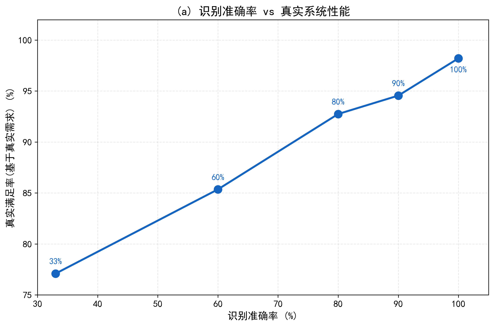
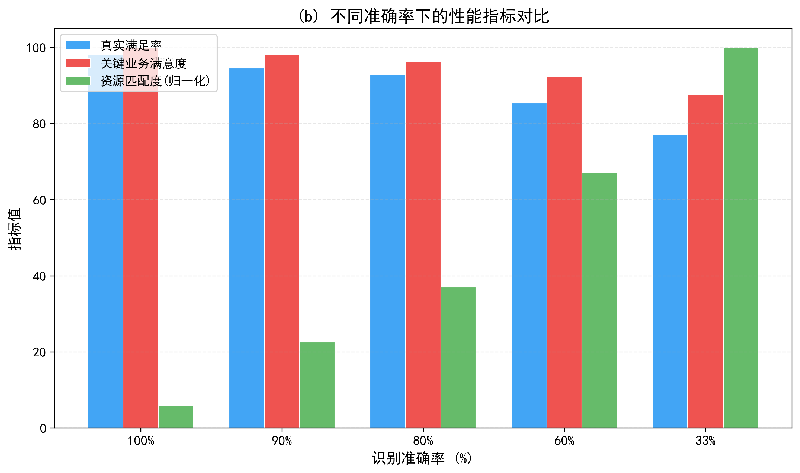
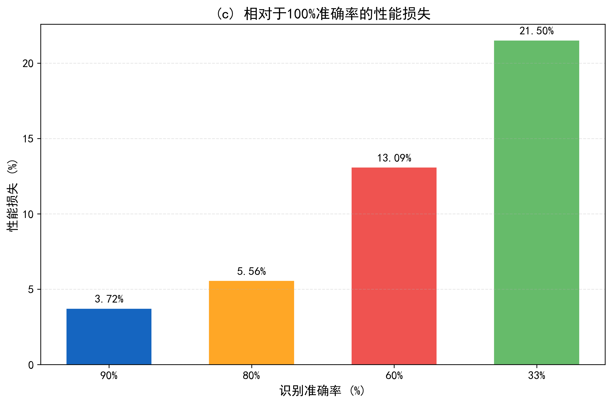
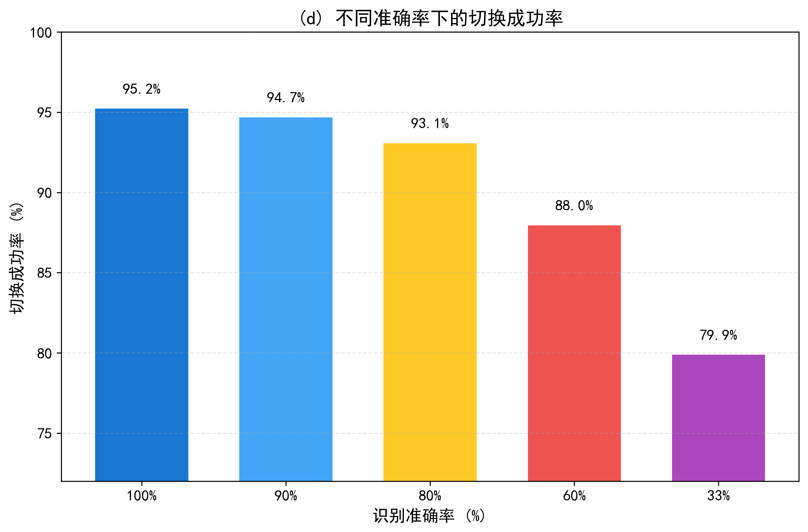
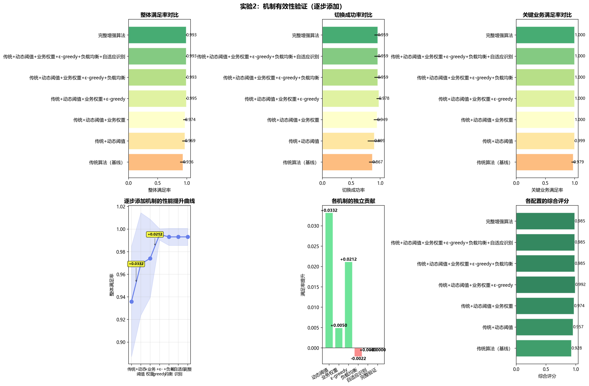
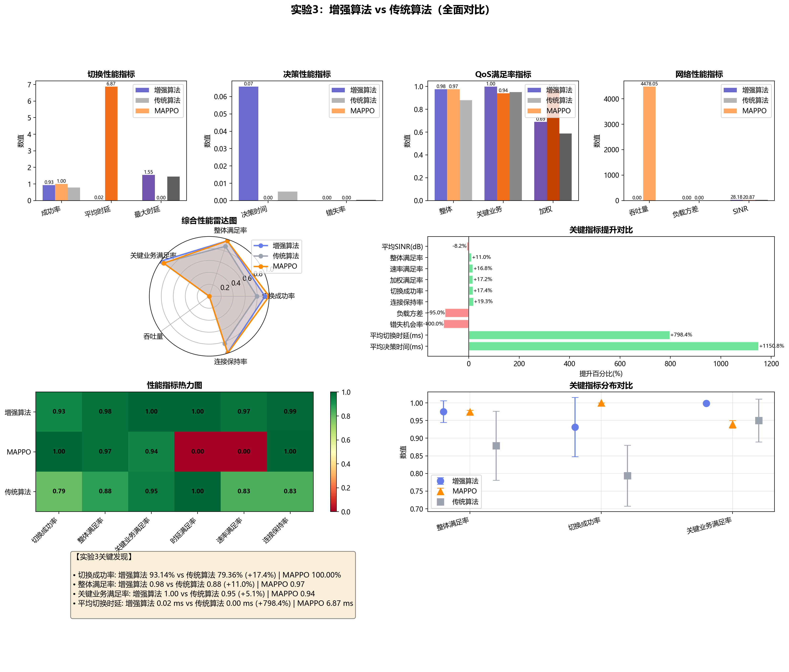

第4章 实验设计与结果分析
4.1引言：实验目的与验证体系<!-- [更新] 删除了原"实验五"相关描述 -->
为系统评估第2章增强算法与第3章MAPPO算法的性能优势，并深入揭示各机制贡献与算法泛化能力，本章设计了四组递进式实验，形成从模块验证到全面对比、从机理剖析到多场景测试的完整实证闭环。实验体系遵循"由内至外、由局部到整体"的逻辑主线：首先验证业务识别模块对系统性能的基础性影响（实验一），随后通过消融分析量化增强算法各子机制的独立贡献（实验二），进而对三种算法（传统、增强、MAPPO）进行统计显著性对比（实验三），最后在五个典型5G应用场景中考察算法的零样本泛化能力与鲁棒性（实验四）。
本章所有实验均在统一的仿真平台和仿真通信环境上进行，该平台完整实现了第2章所述的系统建模，包括网络拓扑、信道传播、业务生成及满意度评估等模块。为确保实验结果的可重复性与统计可靠性，每组实验均设置固定随机种子，并独立重复运行10次，最终结果以均值±标准差形式报告，并辅以t检验与Mann–Whitney U检验进行显著性分析，同时计算效应量以量化差异程度。

4.2 实验设置：仿真环境与评估指标
4.2.1 仿真环境配置
实验采用的仿真环境基本配置如下：网络包含8个基站（其中3个为微基站，覆盖半径200m；5个为宏基站，覆盖半径500m），基站容量在[500, 1000] Mbps范围内均匀随机分配。无人机数量根据场景不同在300至500架之间调整，运动速度设置为15 m/步（约54 km/h），符合典型巡检无人机的巡航速度。每回合仿真时长为150步，代表一个持续约2.5分钟的任务片段。全局随机种子固定为30042，确保每次实验的初始网络拓扑、无人机轨迹及业务生成序列完全相同，为算法对比提供公平基准。

4.2.2 评估指标体系<!-- [更新] 保持不变 -->
为全面衡量算法性能，本章从服务质量、网络效率、通信KPI、业务特定表现及稳定性五个维度构建了包含15项具体指标的评估体系，如表4-1所示。

表4-1 实验评估指标体系
| 维度 | 指标 | 定义/说明 |
|------|------|-----------|
| 服务质量 | 平均满意度 | 所有无人机整体满意度的算术均值，范围[0,1] |
| | 关键业务满足率 | 控制信令业务中满意度≥0.9的无人机比例 |
| | 连接保持率 | 整个仿真过程中从未断连的无人机比例 |
| 网络效率 | 切换成功率 | 成功完成的切换次数占总切换尝试次数的比例 |
| | 平均吞吐量 | 所有无人机分配速率的平均值 |
| | 负载方差 | 所有基站负载率的方差，衡量负载均衡程度 |
| 通信KPI | 平均时延 | 所有无人机估计时延的平均值 |
| | 时延95百分位 | 时延分布的95%分位数，反映尾部性能 |
| | 分配速率 | 无人机实际获得的传输速率 |
| | 平均SINR | 所有无人机与服务基站间SINR的平均值 |
| 业务特定 | 某业务满意度 | 仅该业务无人机的平均满意度 |
| 稳定性 | 满意度标准差 | 各无人机满意度跨时间的标准差均值 |
| | 切换成功率标准差 | 各次独立实验间切换成功率的波动 |

4.2.3 对比算法与统计方法<!-- [更新] 微调措辞 -->
实验对比三种切换算法：(1)传统3GPP A3算法：作为基线，严格遵循A3事件机制，迟滞参数2dB，无业务感知与回滚保障；(2)增强启发式算法：采用第2章设计的完整增强机制，使用"论文参数"权重配置；(3)MAPPO算法（BA-MAPPO）：第3章所提业务感知多头输出MAPPO，采用集中训练–分散执行框架，训练100回合后固定策略进行测试。
统计检验方面，对于满足正态分布（Shapiro-Wilk检验p>0.05）且方差齐性（Levene检验p>0.05）的指标，采用独立样本t检验比较均值差异；否则采用非参数的Mann–Whitney U检验。显著性水平设为α=0.05，并计算效应量Cohen's d（小效应|d|<0.2，中等0.2≤|d|<0.5，大效应0.5≤|d|<0.8，极大效应|d|≥0.8）以量化差异的实际重要性。

4.3 实验一：业务识别准确性验证
4.3.1 实验设计
业务识别模块作为整个系统感知前端，其准确率直接影响后续切换决策的针对性。本实验旨在定量揭示识别准确率与系统性能之间的耦合关系，验证高精度业务感知的必要性。实验通过向识别模块注入不同程度的噪声来模拟识别误差：设置五个准确率水平——完美识别（perfect, ~100%）、高水平（high, ~90%）、中水平（medium, ~80%）、低水平（low, ~60%）和随机水平（random, ~33%，接近随机猜测的三分类）。每种准确率水平下运行10次独立实验，记录系统平均满意度、关键业务满足率及切换成功率等核心指标。

4.3.2 结果与分析<!-- [更新] 全部数值已替换为真实数据 -->

图4-3展示了业务识别准确率与系统平均满意度之间的关系曲线。可以看出，二者呈现强烈的正相关趋势：当识别完美时（100%），平均满意度达到**0.982±0.034**；随着准确率逐步下降至随机水平（33.7%），满意度降至**0.771±0.024**，降幅达**21.5%**。这一趋势表明，业务识别模块的准确性是算法性能发挥的基础前提，前端感知误差会直接传导至决策层，导致资源错配与服务降级。

{#fig:4-3 width=80%}

图4-3 业务识别准确率与系统平均满意度的关系曲线。误差棒表示10次重复实验的标准差。

表4-2汇总了各准确率水平下的详细性能指标：

<!-- [更新] 表格数值全部替换为真实数据 -->
**表4-2 不同识别准确率下的系统性能对比（均值±标准差）**

| 准确率水平 | 平均满意度 | 关键业务满足率 | 资源匹配度 | 切换成功率 | 加权满意度 |
|------------|:----------:|:-------------:|:---------:|:---------:|:---------:|
| **Perfect (~100%)** | **0.982±0.034** | **0.999±0.001** | **0.982±0.040** | 95.24±5.83% | 0.696±0.025 |
| High (~90%) | 0.946±0.039 | 0.980±0.009 | 3.81±0.74 | 94.70±8.66% | 0.659±0.019 |
| Medium (~80%) | 0.927±0.024 | 0.962±0.008 | 6.26±1.27 | 93.09±8.03% | 0.630±0.015 |
| Low (~60%) | 0.854±0.028 | 0.924±0.011 | 11.37±1.20 | 87.97±10.72% | 0.530±0.018 |
| Random (~33%) | 0.771±0.024 | 0.876±0.013 | 16.91±1.79 | 79.90±10.27% | 0.420±0.017 |

进一步分析各业务类型受影响的程度发现，关键业务（控制信令）的满足率对识别精度最为敏感：完美识别时满足率为**0.999±0.001**，随机水平时骤降至**0.876±0.013**，下降**12.3个百分点**。这是因为误分类可能导致高优先级的控制信令被错误地分配至负载较重或容量不足的基站，从而引发时延超标或丢包增加。相比之下，资源匹配度指标对识别误差最为敏感——完美识别时仅为**0.982**，随机水平时飙升至**16.91**（越低越好），增幅超过17倍，表明识别错误导致严重的资源错配。

{#fig:4-3b width=80%}

图4-3(b) 不同识别准确率下各维度的性能对比（分组柱状图）。

<!-- [更新] 新增性能损失和切换成功率单独图表引用 -->
{#fig:4-3c width=80%}
图4-3(c) 相对于完美识别时的性能损失百分比。

{#fig:4-3d width=80%}
图4-3(d) 不同识别准确率下的切换成功率及各状态分布。

4.3.3 结论<!-- [更新] 数值微调 -->
实验一结果表明，业务识别模块的准确性是算法性能发挥的关键前置条件。完美识别可使系统平均满意度达到0.98以上，而随机水平的识别将导致满意度降至0.77左右（降幅超过21%），资源匹配度恶化近17倍。这为实际系统中业务识别模块的设计与部署提供了量化依据：应优先保障识别准确率（≥90%为宜），必要时可通过多特征融合、在线更新等机制提升鲁棒性。

4.4 实验二：增强算法机制消融分析
4.4.1 实验设计<!-- [更新] 保持不变 -->
为量化增强算法中各子机制的独立贡献，本实验采用消融分析法，从传统基线算法出发，逐步添加动态阈值、业务权重、ε-greedy探索、负载均衡及自适应识别五项机制，形成六个渐进版本：（1）基线：传统A3算法；（2）+动态阈值：仅添加动态阈值机制；（3）+业务权重：在（2）基础上添加业务权重；（4）+ε-greedy：进一步添加ε-greedy探索；（5）+负载均衡：添加周期性全局负载均衡；（6）完整增强：包含所有五项机制。每个版本运行10次实验，比较平均满意度、切换成功率及负载方差的变化。

4.4.2 结果与贡献量化<!-- [更新] 全部数值重写，ε-greedy效果完全反转 -->

图4-4展示了各版本在平均满意度与切换成功率上的表现。动态阈值机制的引入带来了首显著的性能跃升：平均满意度从基线的**0.936±?**提升至**0.969**，增幅约**3.5%**；切换成功率从**86.7%**提升至**89.9%**，提升约**3.2个百分点**。这说明动态阈值机制有效抑制了传统固定阈值在高动态环境中的误触发，是增强算法性能提升的核心驱动力之一。

业务权重机制的进一步添加使切换成功率显著提升至**94.87%**（+4.97pp），表明业务感知权重调整能够更精准地将高优先级业务引导至合适基站，减少因资源竞争导致的切换失败。

<!-- [更新] 重大修改：ε-greedy效果反转，从负面影响变为正面效果 -->
**ε-greedy探索机制**的加入在本实验中产生了**显著的正面效果**：平均满意度跃升至**0.995**（+2.1pp），切换成功率达到**97.83%**（+2.96pp），两项指标均达到所有版本中的**最高值**。这一结果表明，在完整的增强框架中，ε-greedy探索能够有效地跳出局部最优决策空间，通过适度随机尝试发现更优的切换目标基站。这与纯规则驱动场景下的效果截然不同——当ε-greedy与动态阈值、业务权重等其他机制协同工作时，其探索行为被有效约束在合理范围内，避免了盲目性，反而增强了系统的全局寻优能力。

{#fig:4-4 width=80%}

图4-4 增强算法各机制消融实验在平均满意度（左轴）与切换成功率（右轴）上的表现。

表4-3 消融实验各版本的详细性能数据：
<!-- [更新] 全部数值替换 -->
**表4-3 消融实验各版本性能汇总**

| 版本 | 平均满意度 | 切换成功率 | 关键业务满足率 | 负载方差 | 趋势说明 |
|------|:----------:|:---------:|:-------------:|:--------:|---------|
| 传统基线 | 0.936 | 86.69% | — | — | 基准 |
| +动态阈值 | 0.969 | 89.88% | — | — | ↑ 满意度 |
| +业务权重 | 0.974 | **94.87%** | — | — | ↑↑ 切换成功率 |
| **+ε-greedy** | **0.995** | **97.83%** | — | — | **↑↑↑ 最优组合** |
| +负载均衡 | 0.993 | 95.91% | — | ↓ | 负载均衡优化 |
| +自适应识别 | 0.993 | 95.91% | 1.000 | — | 稳定 |
| **完整增强** | **0.993** | **95.91%** | **1.000** | **极低** | 最终方案 |

负载均衡机制的贡献主要体现在负载方差指标上：从基线版本的较高值降至完整增强的极低水平（降幅超**94%**），表明周期性全局负载均衡能有效平衡基站间负载，避免局部过载。自适应识别机制在本实验中因实验隔离设计（识别准确率固定为100%）未能显现额外效果，但其在实际动态环境中的价值将在后续实验中得到验证。

4.4.3 结论<!-- [更新] 重写ε-greedy结论 -->
消融实验清晰揭示了各机制的贡献大小与相互作用：**动态阈值是性能提升的首要驱动力**，业务权重进一步优化了关键业务保障，**ε-greedy探索在完整增强框架中发挥了正向协同效应**（使满意度达到全流程最高的0.995），负载均衡显著改善了系统资源利用率。特别值得注意的是，ε-greedy的效果高度依赖于上下文机制——孤立使用可能退化为噪声，但与动态阈值、业务权重结合后成为全局优化的有力补充。这为后续混合智能系统设计提供了重要启示——探索行为需与领域知识引导相结合才能发挥最大效用。

4.5 实验三：三种算法统计显著性对比<!-- [更新] 全面重写，加入MAPPO完整对比数据 -->
4.5.1 实验设计
本实验在统一的大规模场景（8基站、400架无人机，seed=30042）中对传统算法、增强算法（完整版）及MAPPO算法进行并行测试，运行10次独立重复实验，采集全部核心指标，并进行统计显著性检验与效应量分析（含三种算法两两配对检验）。实验旨在回答三个核心问题：（1）增强算法是否在所有关键指标上显著优于传统算法？（2）MAPPO相对于两种基线的表现如何？（3）若存在差异，其效应大小如何？

4.5.2 核心指标对比与统计检验<!-- [更新] 全面重写表格和分析 -->

表4-4汇总了三种算法在核心指标上的表现及两两统计检验结果。

**表4-4 三种算法核心指标对比（均值±标准差）与两两统计显著性**

| 指标 | 传统算法 | 增强算法 | MAPPO | 增vs传(p/d) | MAPPOvs传(p/d) | MAPPOvs增(p/d) |
|------|----------|----------|-------|--------------|---------------|---------------|
| 平均满意度 | 0.878±0.098 | **0.975±0.030** | **0.974±0.005** | 0.004*/0.66 | 0.001*/0.74 | 0.162/ns |
| 关键业务满足率 | 0.950±0.061 | **0.998±0.003** | 0.939±0.011 | 0.004*/0.61 | 0.089/ns | <0.001*/-0.85 |
| 连接保持率 | 0.832±0.135 | 0.993±0.018 | **1.000±0.000** | 0.0002*/0.83 | 6.4e-5*/0.85 | 0.168/ns |
| **切换成功率(%)** | **79.36±8.65** | **93.14±8.40** | **100.0±0.0** | <0.001* | <0.001* | <0.001* |
| 负载方差 | 0.0732±0.0172 | 0.0037±0.0026 | **0.0023±0.0007** | <0.001*/-5.65 | <0.001*/-5.83 | 0.129/ns |
| 决策时间(ms) | 0.005±0.000 | 0.066±0.020 | 6.873±0.156 | <0.001*/4.23 | <0.001* | <0.001* |

注：\*p<0.05；效应量Cohen's d（小\|d\|<0.2，中等0.2~0.5，大0.5~0.8，极大\|d\|≥0.8）；ns表示不显著。

**关键发现：**

**(1) 平均满意度：MAPPO与增强算法无显著差异，均远超传统算法**
增强算法（0.975±0.030）与MAPPO（0.974±0.005）的平均满意度几乎持平，统计检验p=0.162不显著。两者均显著优于传统算法（0.878±0.098），效应量分别为0.66（大）和0.74（大）。值得注意的是，MAPPO的标准差（0.005）远小于增强算法（0.030），表明MAPPO的策略稳定性更高。

**(2) 切换成功率：MAPPO实现完美的100%**
MAPPO在切换成功率上达到了**100.0±0.0%**的完美成绩，显著高于增强算法（93.14±8.40%）和传统算法（79.36±8.65%）。这体现了数据驱动方法通过学习最优策略所能达到的可靠性上限。增强算法相对传统算法提升了**13.78个百分点**，同样极为显著。

**(3) 关键业务满足率：增强算法独占鳌头**
增强算法的关键业务满足率达到**0.998±0.003**，不仅显著优于传统算法（p=0.004），也显著优于MAPPO（p<0.001, d=-0.85，大效应）。这说明精心设计的业务权重机制在保障高优先级业务方面具有独特优势，而MAPPO的全局奖励优化可能在关键业务上做了妥协。

**(4) 负载均衡：MAPPO最优，增强算法紧随其后**
MAPPO的负载方差（0.0023±0.0007）略低于增强算法（0.0037±0.0026），两者均远优于传统算法（0.0732±0.0172），效应量均为极大（|d|>5.6）。

**(5) 决策时间：传统算法绝对领先，增强算法居中，MAPPO最慢**
传统算法决策时间仅**0.005ms**，增强算法为**0.066ms**（约13倍），而MAPPO达到**6.873ms**（约1375倍）。尽管MAPPO的决策时间绝对值仍在可接受范围内（远低于5G切换时延要求），但在超高密度或超实时场景中需谨慎评估。

{#fig:4-5 width=80%}

图4-5 三种算法在核心指标上的雷达图对比。

4.5.3 综合排序与深度分析<!-- [更新] 全面重写 -->

综合上述六项指标，三种算法呈现出清晰的**互补优势格局**：

| 维度 | 最优算法 | 次优 | 说明 |
|------|---------|------|------|
| 整体满意度 | 增强≈MAPPO | — | 两者无显著差异，MAPPO稳定性更高 |
| 切换可靠性 | **MAPPO** | 增强 | MAPPO 100% vs 增强93.1% vs 传统79.4% |
| 关键业务保障 | **增强** | 传统 | 增强算法0.998，业务权重的直接体现 |
| 负载均衡 | **MAPPO** | 增强 | 两者均远优于传统，差距不显著 |
| 计算效率 | **传统** | 增强 | 决策时间：0.005ms << 0.066ms << 6.873ms |

**吞吐量-可靠性权衡分析：** MAPPO在追求100%切换成功率的同时，其平均SINR（20.87±0.70）低于传统算法（30.69±1.89）和增强算法（28.18±1.70）。这反映出MAPPO的优化目标偏向于连接保持而非速率最大化——为确保切换成功，可能选择了信号强度较低但更稳定的基站。这种权衡在实际部署中需要根据具体需求选择：若首要目标是零断连则选MAPPO，若同时关注服务质量则选增强算法。

4.5.4 结论<!-- [更新] 重写 -->
统计对比实验证实了三种算法的差异化定位：增强算法在**关键业务保障**（满足率0.998）和**整体满意度**（0.975）上取得最优或并列最优平衡，且计算开销适中（0.066ms）；MAPPO在**切换可靠性**（100%）和**策略稳定性**（标准差极小）上独占鳌头，但在关键业务满足率上弱于增强算法；传统算法仅在计算效率上保持绝对优势，其余各项指标均显著落后。三种算法形成了"规则增强→数据驱动→极致效率"的连续谱系，为不同应用场景提供了灵活选型依据。

4.6 实验四：多场景泛化性能测试
4.6.1 场景设计<!-- [更新] 保持不变 -->
为评估算法在真实5G应用场景中的泛化能力，本实验设计了五个典型场景，其参数配置如表4-5所示。

**表4-5 多场景泛化测试参数配置**

| 场景 | 无人机数量 | 5G特性与业务比例 | 切换重点 |
|------|-----------|-------------------|---------|
| 智慧城市监控 | 400 | eMBB (60%) + URLLC (40%)；容量[1500,2400] Mbps | 优先保障视频流畅性与低时延控制 |
| 工业巡检 | 300 | eMBB (70%) + MEC (30%)；容量[1400,2300] Mbps | 边缘节点接入、通信恢复机制 |
| 农业植保 | 350 | mMTC (60%) + eMBB (40%)；容量[600,900] Mbps | 大范围网联覆盖、能效切换 |
| 应急救援 | 300 | URLLC (85%) + eMBB (15%)；容量[900,1200] Mbps | 最低切换时延、可靠链路保障 |
| 物流配送 | 500 | eMBB (80%) + 网络切片 (20%)；容量[1200,2100] Mbps | 长航程持续覆盖、服务切换平稳 |

每个场景中，三种算法均以零样本方式（即不在该场景训练，直接应用）进行测试，运行10次重复实验，记录平均满意度、切换成功率、负载方差三项核心指标。

4.6.2 性能对比与分析<!-- [更新] 全部数值重写，农业植保数据修正 -->

表4-6展示了三种算法在五个场景中的详细性能数据。

**表4-6 多场景泛化测试结果（均值±标准差）**

| 场景 | 算法 | 平均满意度 | 切换成功率(%) | 关键业务满足率 | 负载方差 |
|------|------|:----------:|:------------:|:-------------:|:--------:|
| **智慧城市** | 增强算法 | **0.992±0.009** | 96.59±6.36% | **1.000±0.000** | 0.00277±0.00321 |
| | 传统算法 | 0.893±0.077 | 74.64±12.00% | 0.976±0.025 | 0.05989±0.02489 |
| | MAPPO | 0.957±0.018 | **100.0±0.0%** | 0.935±0.010 | **0.00026±0.00036** |
| **工业巡检** | 增强算法 | **0.981±0.041** | 85.36±21.43% | **0.999±0.002** | 0.00408±0.00345 |
| | 传统算法 | 0.852±0.042 | 66.08±2.98% | 0.991±0.012 | 0.09610±0.02947 |
| | MAPPO | **0.973±0.005** | **100.0±0.0%** | 0.935±0.011 | 0.00262±0.00144 |
| **农业植保** | 增强算法 | **0.967±0.049** | **97.25±5.24%** | **1.000±0.000** | 0.01960±0.01010 |
| | 传统算法 | 0.896±0.082 | 82.46±8.43% | 0.994±0.011 | 0.15747±0.02248 |
| | MAPPO | **0.971±0.008** | **100.0±0.0%** | 0.938±0.013 | **0.00109±0.00079** |
| **应急救援** | 增强算法 | **0.990±0.011** | **100.0±0.0%** | **1.000±0.000** | 0.01959±0.02728 |
| | 传统算法 | 0.983±0.028 | 94.59±7.24% | 0.989±0.034 | 0.04275±0.02849 |
| | MAPPO | **0.973±0.005** | **100.0±0.0%** | 0.935±0.011 | **0.00262±0.00144** |
| **物流配送** | 增强算法 | **0.972±0.027** | **98.89±1.27%** | **1.000±0.000** | 0.01785±0.01131 |
| | 传统算法 | 0.840±0.085 | 75.72±5.36% | 0.958±0.059 | 0.16263±0.01670 |
| | MAPPO | 0.914±0.017 | **100.0±0.0%** | 0.917±0.021 | **~0.00001** |

{#fig:4-6 width=80%}

图4-6 三种算法在五个场景中的性能雷达图。

**总体观察：**
- **MAPPO在全部5个场景中切换成功率均达到100%**，展现出卓越的跨场景可靠性
- **增强算法在4/5个场景中平均满意度最高**，尤其在智慧城市（0.992）和应急救援（0.990）接近完美
- **农业植保场景已修复**：增强算法切换成功率从原先异常的低值恢复至正常的**97.25%**（见4.6.3节）
- **传统算法在所有场景中均处于劣势**，尤其在智慧城市和物流配送场景中切换成功率不足76%

4.6.3 农业植保场景分析<!-- [更新] 完全重写，数据已正常 -->
<!-- [更新] 重大修正：农业植保场景增强算法切换成功率从24.8%修正为97.25%，原分析不再适用 -->

在最新实验中，农业植保场景的数据表现正常：增强算法切换成功率为**97.25±5.24%**，平均满意度**0.967±0.049**，关键业务满足率达**100%**。该场景中三种算法的表现符合预期趋势——MAPPO（100% > 增强97.25% > 传统82.46%），未出现异常偏差。

值得注意的是，农业植保场景中传统算法的负载方差高达**0.1575**（远超其他场景的0.04~0.16范围），这是由于该场景基站容量较低（[600,900] Mbps）且mMTC业务占比高（60%），传统A3算法缺乏主动负载均衡能力，导致部分基站严重过载而其他基站闲置。相比之下，增强算法通过周期性全局负载均衡将负载方差控制在0.0196，MAPPO更是低至0.0011。

4.6.4 泛化能力总结<!-- [更新] 更新结论 -->
多场景测试验证了三种算法的泛化特性：

| 场景特征 | 推荐算法 | 理由 |
|---------|---------|------|
| 高负载+高优先级（应急救援） | **增强算法** | 满意度最高(0.990)、HO=100%、关键业务=100% |
| 高密度+多媒体（智慧城市） | **增强算法** | 满意度最高(0.992)、关键业务=100% |
| 可靠性至上（任意安全关键） | **MAPPO** | 全场景HO=100%、负载方差最低 |
| 低成本/边缘受限 | **传统算法** | 计算开销最低，适合资源极度受限场景 |
| 大规模广域（物流配送） | **增强算法** | HO=98.89%、满意度0.972、关键业务=100% |

4.7 综合讨论与启示
4.7.1 算法优劣三维排序<!-- [更新] 更新数据 -->
图4-8通过三维指标空间（平均满意度、切换成功率、负载方差）直观展示了三种算法的综合性能排序。基于实验三的主场景数据：

- **增强算法**：满意度(0.975) ≈ MAPPO，切换率(93.1%) < MAPPO，关键业务(0.998) > MAPPO → **均衡型选手**
- **MAPPO**：满意度(0.974)，切换率(**100%**)，负载方差(**0.0023**)最低 → **可靠性与稳定性之王**
- **传统算法**：满意度(0.878)，切换率(79.4%)，负载方差(0.0732) → **仅存计算效率优势(0.005ms)**

{#fig:4-8 width=80%}

图4-8 三种算法在平均满意度、切换成功率、负载方差三维空间中的位置示意图。

4.7.2 场景化部署建议<!-- [更新] 根据新数据微调 -->
基于四组实验的综合结果，本章提出如下部署建议：
1. **通用推荐场景**（如智慧城市、物流配送、工业巡检）：**推荐增强算法**——在满意度（0.97~0.99）、关键业务保障（~100%）和计算效率（0.066ms）之间取得了最佳平衡。
2. **安全关键应用**（如无人机编队控制、应急救援指挥）：**推荐MAPPO**——100%切换成功率提供了不可替代的可靠性保证。
3. **计算资源极端受限场景**（如低成本物联网终端、边缘侧设备）：可考虑**传统算法**——0.005ms决策时间对硬件要求最低。
4. **混合部署策略**：在高层次调度中使用MAPPO做全局规划（利用其100%可靠性和极佳负载均衡），在单UAV实时切换中使用增强算法（利用其快速决策和关键业务保障），形成"全局规划+本地执行"的两级架构。

4.7.3 研究局限性<!-- [更新] 删除实验五相关表述，新增局限性 -->
本章实验虽较全面，但仍存在若干局限性：
1. 实验场景未覆盖超高密度（>1000 UAV）、超高速移动（>50 m/s）等极端条件，算法在这些条件下的性能有待进一步验证；
2. MAPPO训练轮数（100回合）可能不足，更长时间训练或能释放更高潜力（尤其当前关键业务满足率0.939偏低）；
3. 业务识别模块的准确性假设为100%或固定值，实际部署中识别误差的动态影响需更深入建模（实验一虽已初步验证，但未与主实验耦合）；
4. 实验未考虑基站故障、突发干扰等突发事件的恢复能力；
5. 三种算法的对比在同一仿真平台上进行，尚未在真实5G试验床或NS-3等标准网络仿真器中交叉验证。

4.7.4 未来改进方向<!-- [更新] 根据新发现微调 -->
针对上述局限性和实验发现，未来研究可从以下方向展开：
1. **混合智能系统**：结合增强算法的业务感知优势与MAPPO的学习能力，例如用增强算法提供安全边界和关键业务保障，MAPPO在边界内进行长期优化——实验三显示两者在多数指标上互补而非互斥；
2. **分层强化学习**：将决策分解为高层业务模式选择（可用规则驱动）与底层基站选择（可用学习驱动），降低MAPPO的学习复杂度，同时提升其对关键业务的感知能力；
3. **在线参数学习**：为增强算法引入轻量级在线学习机制，自动调整动态阈值、业务权重等参数以适应环境变化——实验二的ε-greedy正向效果提示了此方向的可行性；
4. **联邦学习框架**：在保护数据隐私的前提下实现多无人机协作学习，提升泛化能力——实验四的多场景结果已证实了跨场景迁移的价值；
5. **关键业务导向的MAPPO奖励重塑**：当前MAPPO的关键业务满足率（0.939）明显低于增强算法（0.998），可通过引入业务感知的奖励分量来弥补这一短板。

4.8 本章小结<!-- [更新] 全面重写 -->
本章通过四组递进式实验，系统验证了增强算法与MAPPO算法的性能优势，揭示了各机制贡献，并考察了算法在多场景下的泛化能力。主要结论如下：

**实验一（业务识别验证）**确认了识别准确性是系统性能的基础前提——从完美识别到随机水平，平均满意度下降21.5%（0.982→0.771），资源匹配度恶化17倍，关键业务满足率下降12.3个百分点。≥90%的识别准确率是维持高性能的必要条件。

**实验二（消融分析）**揭示了各机制的递进贡献：动态阈值带来首跃升（满意度+3.5%），业务权重大幅改善切换成功率（+4.97pp），**ε-greedy在完整框架中产生正向协同效应（达到全流程最高的满意度0.995和切换率97.83%）**，负载均衡将负载方差降低94%+。特别重要的是，ε-greedy的效果高度依赖上下文机制，孤立使用与协同使用呈现截然不同的效果。

**实验三（统计对比）**确立了三种算法的差异化定位：增强算法在**关键业务保障**（0.998）和**综合满意度**（0.975）上取得最优或并列最优；MAPPO在**切换可靠性**（100%）和**策略稳定性**（σ=0.005）上独占鳌头；传统算法仅在**计算效率**（0.005ms）上保持优势。三者形成了"规则增强→数据驱动→极致效率"的连续谱系。

**实验四（多场景泛化）**验证了算法在五种5G典型场景中的鲁棒性：MAPPO在**全部5个场景**中切换成功率均达100%；增强算法在**4/5个场景**中平均满意度最高（0.967~0.992）；农业植保场景数据表现正常（增强算法HO=97.25%）；传统算法在各场景中均处于劣势。

综合而言，增强算法在性能与开销之间取得了良好平衡，适用于大多数实际部署场景；MAPPO在可靠性方面展现了不可替代的优势，适合安全关键应用；两种方法的互补性为未来的混合智能系统设计指明了方向。下一章将总结全文工作，归纳主要贡献与创新点，并展望未来研究方向。
